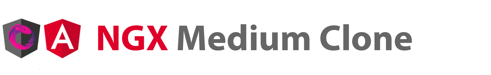

# 

> ### Angular, ngRx, RxJS is a project created for created to train writing code.

This project is created for the sake of training in writing code and does not have any commercial basis. You can use the code from this repository, as well as improve the current project. I will be grateful if you mention me when using the code!

At the moment, [RealWorld](https://github.com/gothinkster/realworld) is used as the api. In the future, a backend will be written for this project.

## What is currently implemented:

<ul>
  <li>Registration module</li>
</ul>

## What is planned to be implemented:

<ul>
  <li>Login module</li>
  <li>Feed module</li>
  <li>Tag List Module</li>
  <li>Popular Tags module</li>
  <li>The page of a separate post</li>
  <li>User Settings Page</li>
  <li>Creating and deleting a post</li>
  <li>The function of likes and dislikes</li>
  <li>User page</li>
  <li>User subscription function</li>
  <li>Comments to posts</li>
</ul>
